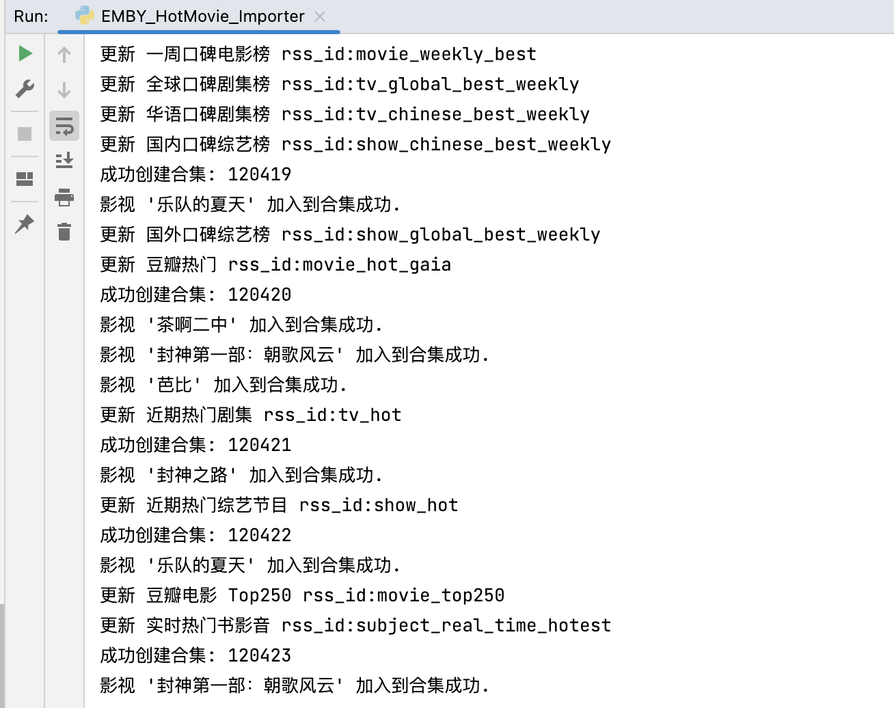

# 根据豆瓣rss自动创建emby合集

参考 https://github.com/Baiganjia/EMBY_HotMovie_Importer 实现

# 运行效果



需部署RSSHub
``` docker-compose
version: '3'
services:
  rsshub:
    image: xuanqb/rsshub:latest
    restart: unless-stopped
    ports:
      - 1200:1200
    environment:
      NODE_ENV: production
    container_name: rsshub
```

# 配置文件
``` conf
[Server]
# 这里填入你Emby服务器地址
emby_server = http://xxx.xx.xx.x:8096
# 这里填入你Emby API密钥
emby_api_key = xxxxxxx
rsshub_server = http://xx.xx.x.x:1200

[Collection]
#各种榜单
rss_ids=movie_weekly_best,tv_global_best_weekly,tv_chinese_best_weekly,show_chinese_best_weekly,show_global_best_weekly,movie_hot_gaia,tv_hot,show_hot,movie_top250,subject_real_time_hotest
```

# 运行
``` python
pip install -r requirements.txt
python EMBY_HotMovie_Importer.py
```
